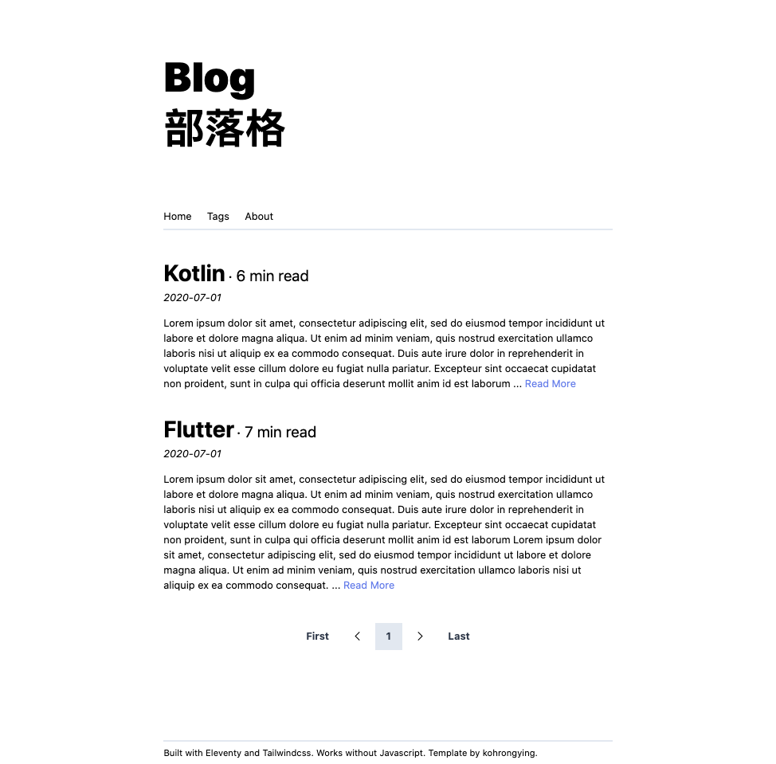

# Blog starter

## Aims
A blog that still runs without javascript. Hence, no bundlers. 

## Includes
1. Static Site Gen - Eleventy
2. CSS Framework - Tailwindcss (through CDN)
3. Tailwind Styling with Markdown
  - Mapping in `.eleventy.js`
  - Styles taken from this helpful [repo](https://github.com/iandinwoodie/github-markdown-tailwindcss/blob/master/markdown.css)
4. Custom ReadTime filter
5. 404 page
6. Tags page to view posts related to tag
  - Use of a `tagList` collection defined in `.eleventy.js`
  - `/tags` - show all available tags (excluding all and posts) as buttons (`tags.md`)
  - `/tags/tag-name` - shows all posts related to that tag (`tagList.md`)
7. Sitemap and Robots.txt 
  - Change site url in `_data/site.json`
8. Posts pagination in `index.html` 
  - change the `size` frontmatter variable
9. ESLint

## Deployment
On Netlify / Surge / Firebase hosting / etc hosting providers

Build Command: `npm run build`

Output folder: `_site`

## Future Improvemeents

- [ ] Minification of assets
- [ ] Make next/prev posts
