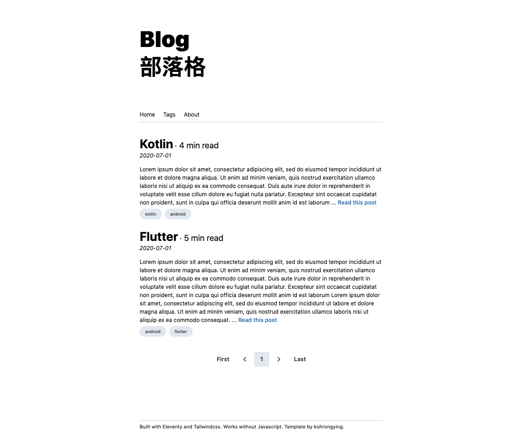

# Blog starter

[](https://app.netlify.com/sites/eleventy-blog-starter/deploys)

View the live demo [here](https://eleventy.rongying.co/), hosted on Netlify




## Aims
A blog that still runs without javascript. Hence, no bundlers. 


## Features
- Static Site Gen - Eleventy

- CSS Framework - Tailwindcss (through CDN)
+ Tailwind Styling with Markdown
  - Mapping in `.eleventy.js`
  - Styles taken from this helpful [repo](https://github.com/iandinwoodie/github-markdown-tailwindcss/blob/master/markdown.css)

- Create excerpts using the `<!-- excerpt -->`

- Custom ReadTime filter

- 404 page

+ Tags page to view posts related to tag
  - Use of a `tagList` collection defined in `.eleventy.js`
  - `/tags` - show all available tags (excluding all and posts) as buttons (`tags.md`)
  - `/tags/tag-name` - shows all posts related to that tag (`tagList.md`)

+ Sitemap and Robots.txt 
  - Change site url in `_data/site.json`

+ Shortcode to handle images
  - Add image under `src/assets/img/posts` and use the asset_img short code
  - `` eg. ``

- Draft posts using the `published` frontmatter

+ Posts pagination in `index.html` 
  - change the `size` frontmatter variable
- ESLint

+ Node script to create new post (based on YYYY and MM)
```bash
node createMdScript.js this is my title

$ Created new post at src/posts/2020/07/this-is-my-title.md
```


## Running locally

Create your blogpost under `src/posts`. I like to have mine sorted by YY/MM.

Navigate to localhost:8080 after starting the server.
```
npm start
```


## Deployment
[](
https://app.netlify.com/start/deploy?repository=https://github.com/kohrongying/11ty-blog-starter)


On Netlify / Surge / Firebase hosting / etc hosting providers

Build Command: `npm run build`

Output folder: `_site`

<!--
## Future Improvemeents

- [ ] Minification of assets
- [ ] Make next/prev posts
-->